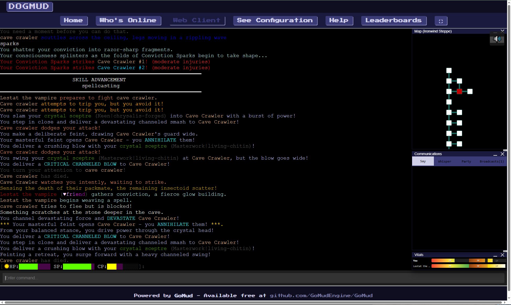

# DOGMud — Delusions of Grandeur

**Delusions of Grandeur** is a text-based MUD set on Gaius, a colony
world whose survivors have forgotten where they came from. A symbiotic
organism called **The Chrysalis** infects the population, making belief
literally become reality — it manifests as "magic," reshapes bodies
into physical mutations, and slowly remakes the world around its hosts.

DOGMud is built on the [GoMud](https://github.com/GoMudEngine/GoMud)
engine but has been substantially extended: a distribution-based
combat math, conviction-powered spellcasting, a 14-state grappling
system, a living economy driven by caravans and foragers, NPCs that
remember how you've treated them and faction reputation that travels
between them, and a centralized messaging framework that paints every
combat round in color-coded prose. Most of the world, all of the
systems below, and the codebase architecture under them have been
written specifically for DOGMud.

The screenshot above is the chunk-7 messaging framework in action: per-
swing weapon-band color (each weapon's narration in its own hue), a
SKILL ADVANCEMENT banner mid-fight (spellcasting just advanced), the
side-by-side minimap layout, and per-player line wrapping. See
[PATCH_NOTES.md](PATCH_NOTES.md) for the full shipping log.

---

## Systems

### Combat

- **Distribution-based rolling.** Every stat and skill check rolls a
  normal distribution around a target value via `dice.RollStat`, with
  a single `RollSpread` knob that rescales the variance across the
  whole engine. Z-scores feed crit (≥2σ) and fumble (≤−2σ) detection.
- **Three damage channels.** Physical (Strength × weapon skill ×
  weapon multiplier), magical (Willpower × spellcasting × spell
  multiplier), conviction (Charisma × rhetoric × 0.5). Each channel
  has its own mitigation field on armor and its own cap.
- **Multi-arm characters.** Mutations (or the Extra Arms ladder) let
  a character wield up to six weapons simultaneously. The unified
  damage pipeline drains a single per-round `AttackResult` that
  carries per-swing analytics, defense-used flags, and per-line
  category tags for messaging.
- **Best-of-all defense.** Dodge, parry, and block all roll
  independently each swing; the widest-margin defense wins. Stat-
  gapped fights still grant a configurable minimum defense floor.
- **Rich grappling.** A 14-state Position FSM (Standing / Clinch /
  Mount / SideControl / Crucifix / Guard / etc.) with per-round
  opposed Strength + Unarmed-combat rolls driving a control axis.
  Position transitions cascade through threshold-triggered
  promotions; weapon reach matters (a longsword in mount swings
  short). Eat, drink, cast, flee — most non-grapple actions get
  gated or interrupted from controlled positions.

### Magic & Mutations

- **Conviction-powered spellcasting.** Spells cost conviction (not
  mana), accumulate folds over wait-rounds, and resolve through a
  per-school category pipeline.
- **Five schools.** Elemental (fire / ice / lightning damage),
  Enhancement (buffs / shields), Mental (charm / illusion), Vital
  (heal / cure), Manifestation (summon / raise).
- **Spell deflection + concentration.** Defenders roll to partially
  or fully unravel incoming spells. Position-aware concentration
  checks (chunk 4f) replace the old "knocked down = guaranteed
  fizzle" gate with Willpower-mediated odds; strong-willed casters
  can sometimes finish a spell from underneath.
- **41 mutations.** The Chrysalis grants belief-driven physical
  changes — Extra Arms, infrared vision, gear-effectiveness
  modifiers, regen multipliers in light, magical resistance,
  perception-tuned The Eye phases, and more.

### NPC Aliveness

- **Opinion store.** Every NPC remembers how individual players have
  treated them (attacks, gifts, quest outcomes), banded into tiers
  with anchored half-life decay. Reputation isn't reset on logout.
- **Faction system.** NPCs are tagged into factions
  (`thornwall_guards`, `warren`, etc.) with ally/enemy graphs and
  shared reputation. Attacking one warren mob bumps your rep with
  every warren mob; quest outcomes can shift entire factions.
- **Crime / wanted state.** Witnessed assaults and thefts persist as
  crimes with faction-scoped resolution. Guards remember; bounties
  accumulate.
- **Disposition decay.** A configurable half-life smooths out
  short-term spikes — punching a guard hard once doesn't permanently
  brand you a criminal across the realm.

### Living Economy

- **Dynamic vendor pricing.** Shop stock and demand drive prices on
  a 0.25× – 5× curve. Overstock = bargain; near-empty = inflated.
- **Per-vendor specialization.** Shops have category tags (food,
  weapons, alchemy reagents, etc.) and stock caps that scale with
  item rarity tier.
- **Caravans + foragers.** Six-mob caravans physically haul goods
  between Thornwall and Stillwater. Three foragers gather raw
  materials in the wild (Tova / Halix / Kessa) and deliver them to
  local shops. Stock isn't conjured from thin air — supply chains
  matter.
- **Crafter output.** Player-crafted items can be sold to
  participating shops as supply.

### Stats, Skills & Progression

- **Six stats.** Strength, Dexterity, Perception, Vitality,
  Willpower, Charisma — all centered at 100 (human baseline). Soft
  cap with diminishing returns above 150.
- **Nine skills.** Use-based progression only — no XP, no levels.
  Every skill use rolls a chance to advance; the chance bends down
  past the soft cap. Skills cap softly at 50.
- **Three moons** (Swiftmoon, The Wanderer, The Eye) orbit Gaius,
  modulating stat values by phase. The Eye specifically tunes
  Perception → folds-per-round for mutated traditional casters.
- **Resource depletion penalties.** Smooth curve: stamina drains hit
  rate + attack count, health drains melee damage, conviction drains
  taunt + spell damage. No hard cutoffs.

### Crafting, Alchemy, Salvage

- **Five trades.** Tailoring, blacksmithing, jewelcrafting,
  alchemy, ... each gated by skill rank + ingredient component tags.
- **Alchemy with aging + toxicity.** Witcher-flavored potions
  ferment, peak, decline, and spoil over rounds. Toxicity
  accumulates and decays; over the threshold, you suffer regen +
  perception + dexterity penalties.
- **Bottle tiers.** Clay flask (fast aging) → glass vial (baseline)
  → sealed phial (half) → crystalline decanter (quarter). Choice of
  bottle is a real tradeoff between alchemist skill and patience.
- **Salvage.** Break crafted items (or items tagged with
  `salvage_returns`) down to raw materials. Multi-round activity
  gated by Perception + Salvage skill.

### World

- **Roughly 515 rooms across 21 zones.** Sanctum Basin (the starter
  zone), Thornwall City, Stillwater, Ironwind Steppe, Fernway and
  Fernway South, Dustwalk, the Labyrinth, North Road, Lake Iron,
  Stillwater Marsh, plus instanced arenas and planar oases.
- **226 mobs + 41 species.** Each mob carries a default disposition,
  optional faction membership, idle behavior tree, and (for hostile
  archetypes) drop tables.
- **21 quests** running through the quest engine — branching
  dialogue, flag-based state, faction-aware grants, multi-step
  task chains.

### State Machines (chunks 0-6)

Seven FSMs underpin character behavior:

- **Combat Phase** — Idle / Engaging / Engaged / EndOfRound, surprise
  attack handshake
- **Awareness** — Unaware / Concealing / Hidden / Revealing / Visible
- **Life** — Alive / Dead / Respawning (different paths for
  players vs mobs)
- **Activity** — what the character is busy doing (crafting /
  casting / consuming / etc.)
- **Position** — the 14-state grappling taxonomy described above
- **Presence** — Active / Idle / AFK / Dormant; mob hibernation
  when no players nearby; AFK players in safe rooms are
  un-attackable
- **Perception** — Sighted / Blinded; consumed by the messaging
  pipeline's sight gate

Most are invisible to the player but underpin every interaction
between characters and the world.

### Messaging Framework (chunk 7)

Every player-facing line of text routes through one pipeline:
compose → normalize → anonymize → color → wrap → deliver.

- **Color-coded combat.** Each swing colored by weapon damage band
  (warhammer warm orange-brown, sword dusty rose, claws dark red,
  bows sky blue, wands lavender, fists sandy brown). Defenses in
  greens (dodge / parry / block).
- **Five-school spell palette.** Elemental red, enhancement gold,
  vital sage, mental lavender, manifestation rose pink. Fold-cast
  lifecycle in steel-cyan; disruptions in amber.
- **Progression banners.** Skill and stat advancements render as
  boxed banners with a tier-crossing line on quality-band
  transitions.
- **Per-player line wrapping.** `set linewidth N` (40–240).
  ANSI-aware: color tags don't count against the budget.
- **Infrared anonymization.** Players with infrared vision in a
  dark room see "red figures" instead of named characters.

### Companions & AI

- **Player-summoned companions** with two AI archetypes (tank,
  damage), auto-follow, regen ticking, and combat assist.
- **Mob behavior trees** for hostile / lookout / forager / caravan /
  shopkeeper archetypes — each with its own decision logic.
- **Autonomous AI tester characters.** Three test roles
  (`feature-tester`, `bug-finder`, `feel-tester`) connect to the
  MUD via LLM-driven agents and play the game to surface bugs and
  UX issues.

### Admin & Operator Tooling

- Faction `list / show / set / bump / reset`
- Opinion `show / set / bump / reset`
- Economy health dashboard (`/admin/economy/`)
- Knowledge subsystem for tracking who knows what
- Live `combatstats` for per-character analytics

---

## Connecting

**Telnet**: connect to `localhost` on port `33333` with a telnet client.

**Web client**: [http://localhost/webclient](http://localhost/webclient)

Default credentials for a fresh checkout: username `admin`, password
`password`.

## Environment Variables

When running the server, several environment variables alter behavior:

- **`CONFIG_PATH`**`=/path/to/alternative/config.yaml` — Path to a
  config containing only values you wish to override, so you don't
  have to modify the original `config.yaml`.
- **`LOG_PATH`**`=/path/to/log.txt` — Write all logs to a specific
  file (default: stderr).
- **`LOG_LEVEL`**`={LOW/MEDIUM/HIGH}` — Verbosity. Log files rotate
  every 100MB.
- **`LOG_NOCOLOR`**`=1` — Strip color from log output.

## Documentation

- [world.md](world.md) — full world-design document (lore, factions,
  zones, species).
- [DEVELOPMENT_PLAN.md](DEVELOPMENT_PLAN.md) — current implementation
  roadmap.
- [PATCH_NOTES.md](PATCH_NOTES.md) — dated shipping log; see this for
  the chronological detail of what was added when.
- [MOB_ALIVENESS_ROADMAP.md](MOB_ALIVENESS_ROADMAP.md) — long-term
  roadmap for NPC memory, schedules, motivations, equipment-
  awareness, and mob/player command parity.

---

## Built on GoMud

DOGMud is built on [GoMud](https://github.com/GoMudEngine/GoMud), an
open-source MUD engine written in Go by
[the GoMud team](https://github.com/GoMudEngine). GoMud provides the
networking, templating, scripting, web-client, and world-loader engine
that DOGMud builds upon. If you're interested in building your own
MUD, the original project is well worth checking out:

- [GoMud GitHub](https://github.com/GoMudEngine/GoMud)
- [GoMud Discord](https://discord.gg/cjukKvQWyy)
- [GoMud Discussions](https://github.com/GoMudEngine/GoMud/discussions)
- [GoMud Guides](_datafiles/guides/README.md)
- [GoMud Contributing Guide](https://github.com/GoMudEngine/GoMud/blob/master/.github/CONTRIBUTING.md)

### GoMud Feature Demos

- [Auto-complete input](https://youtu.be/7sG-FFHdhtI)
- [In-game maps](https://youtu.be/navCCH-mz_8)
- [Quests / Quest Progress](https://youtu.be/3zIClk3ewTU)
- [Lockpicking](https://youtu.be/-zgw99oI0XY)
- [Hired Mercs](https://youtu.be/semi97yokZE)
- [TinyMap](https://www.youtube.com/watch?v=VLNF5oM4pWw)
- [256 Color / xterm](https://www.youtube.com/watch?v=gGSrLwdVZZQ)
- [Customizable Prompts](https://www.youtube.com/watch?v=MFkmjSTL0Ds)
- [Mob/NPC Scripting](https://www.youtube.com/watch?v=li2k1N4p74o)
- [Room Scripting](https://www.youtube.com/watch?v=n1qNUjhyOqg)
- [Kill Stats](https://www.youtube.com/watch?v=4aXs8JNj5Cc)
- [Searchable Inventory](https://www.youtube.com/watch?v=iDUbdeR2BUg)
- [Day/Night Cycles](https://www.youtube.com/watch?v=CiEbOp244cw)
- [Web Socket "Virtual Terminal"](https://www.youtube.com/watch?v=L-qtybXO4aw)
- [Alternate Characters](https://www.youtube.com/watch?v=VERF2l70W34)

### ANSI Colors

Colorization is handled through extensive use of
[github.com/GoMudEngine/ansitags](https://github.com/GoMudEngine/ansitags).

### Why Go?

Why not? Go gives us:

- **Compatible** — high compatibility across platforms and CPU
  architectures.
- **Fast** — both runtime and build.
- **Opinionated** — established style + patterns.
- **Modern** — relatively new, without decades of accumulated
  complexity.
- **Upgradable** — Go's backward-compatibility promise keeps
  upgrades painless.
- **Statically linked** — if you have the binary, you have the
  working program.
- **No central registries** — library includes straight from their
  repos.
- **Concurrent** — concurrency built in as a language feature, not
  a library.
