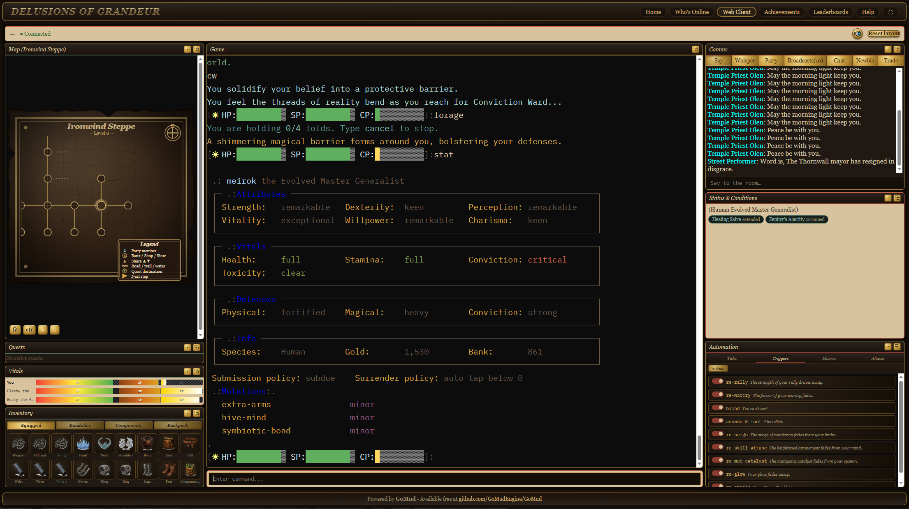

# Delusions of Grandeur (DOGMud)

**Play now:** [www.dogmud.org](https://www.dogmud.org) (in your browser) ·
telnet `dogmud.org 33333` · **Free. Open beta. No monetization.**

On the colony world of **Gaius**, belief matters. A symbiotic organism
called **the Chrysalis** lives in every person, and it makes conviction
physically real: magic is faith made manifest, and the way you live slowly
reshapes what you are. The survivors of an old catastrophe have forgotten
where they came from — but under the oldest hills, something that fell from
the sky a very long time ago is still waiting to be understood.

*The browser client in play: a hand-drawn zone map with quest markers, the
descriptive stat sheet (no raw numbers — your character is "remarkable,"
not "127"), live vitals for you and your companions, icon-based inventory,
chat channels, active conditions, and a full trigger/macro/alias automation
panel.*

---

## What to expect as a player

### You are what you practice — no levels, no classes, no XP

Every stat and skill in the game advances **only through use**. Swing a
blade and your blade-arm grows; haggle, taunt, and orate and your voice
becomes a weapon; fold conviction into spells and the folds come easier.
There is no character sheet to pre-plan and no build to ruin — your
character becomes a record of how you actually played.

And the Chrysalis is watching. Fight like a wall and it thickens your hide;
skulk and it sharpens your senses. **Mutations emerge to match your
playstyle** — drifting outward from small generalist gifts toward nine
identity clusters (Colossus, Ironhide, Ravener, Stalker, Ethereal,
Manifester, Zealot, Weaver, Trickster), each crowned by a single earned
apex transformation. Extra arms are real, rare, and let you wield up to six
weapons at once. No menu. No respec. You grow what you've earned.

### Three ways to fight — all of them real

- **Body** — weapons, fists, and a deep grappling system: clinch, mount,
  side control, submissions, with position gating what both of you can do.
  Weapon reach matters; a longsword swings short from inside a clinch.
- **Belief** — conviction-powered spellcasting across five schools
  (elemental, enhancement, mental, vital, manifestation). Spells build in
  folds over rounds; defenders can unravel them; the strong-willed can
  finish a cast flat on their back.
- **Voice** — rhetoric is a true damage channel. Taunts hit, hold enemy
  attention, and scale like any other weapon.

Combat resolves on distribution-based rolls (crits and fumbles live in the
tails, not on a d20), dodge/parry/block all genuinely compete every swing,
and every line of the round is painted in color-coded prose. What you never
see: raw damage numbers. Wounds are "light" or "grievous"; your foe is
"staggering," not "at 34%."

### A world that runs whether you're there or not

- **Shops with real economies** — vendors price by their own stock and
  gold: overstocked goods go cheap, scarce ones inflate. Caravans and
  ferries physically haul the supply; foragers gather it; player crafters
  can sell into it.
- **An auction house with NPC bidders** — collectors, crafters,
  adventurers, a merchants' guild, and a crown assessor all bid real gold
  against you (and each other).
- **NPCs with lives** — townsfolk keep daily schedules, walk patrol
  routes, chat with each other, and *remember you*: gifts, insults,
  attacks, and quest outcomes persist, and reputation travels along
  faction lines. Guards remember crimes. Bounties accumulate.
- **Weather, seasons, and three moons** — storm fronts roll across zones,
  seasons turn, and the moons' phases mechanically pull at stats and magic.

### Things to do besides fight

Forty-nine zones and 1,300+ rooms of wilderness, cities, ruins, and worse;
around eighty quests with branching dialogue and real choices; five
crafting trades plus witcher-style alchemy where potions ferment, peak, and
spoil (and toxicity is a resource you gamble with); salvage and foraging
for materials; player guilds with shared treasuries; achievements
and leaderboards; global chat, trade, and newbie channels; player-to-player
mail with gold and item attachments; banks, warehouses, and a paid instance
or two for when your party wants something that hits back properly.

### Made to be easy to start

- **Play in the browser** at [dogmud.org](https://www.dogmud.org) — the
  full dashboard client in the screenshot above, with maps, quest
  tracking, clickable everything, and an automation panel (triggers,
  macros, aliases) built in. Or use any telnet/MUD client you already
  love: `dogmud.org 33333` (GMCP, MSP, 256-color, UTF-8).
- **A guided tutorial** if you've never played a MUD: a patient guide
  walks you through looking, moving, talking, and your first fight, one
  step at a time. Genre veterans can skip straight into the world.
- **Updates without disconnects** — the server hot-restarts in seconds;
  telnet sessions hold straight through and the web client reconnects
  itself.

---

## For the curious and the technical

DOGMud's world, systems, and much of the architecture are custom-built:
distribution-based combat math, a unified three-channel damage pipeline, a
14-state grappling FSM, the mutation cluster graph, the living-economy
loop, NPC opinion/faction/crime memory, a schedule/patrol/conversation
layer, and a centralized messaging pipeline (compose → normalize →
anonymize → color → wrap → deliver). Autonomous LLM playtest agents
("bug-finder," "feel-tester") play the game to surface issues before
players do.

- [docs/world.md](docs/world.md) — the world-design document (lore,
  factions, zones, species)
- [docs/PATCH_NOTES.md](docs/PATCH_NOTES.md) — dated shipping log of
  everything
- [docs/](docs/) — schemas, guides, and system specs
- [novel/](novel/) — *What the Moons Keep*, a novel set on Gaius

### Running your own copy

Clone, `go run .`, and connect to `localhost:33333` (telnet) or
`http://localhost/webclient`. A fresh checkout's default login is
`admin` / `password` (you'll be forced to change it). Useful environment
variables:

- `CONFIG_PATH=/path/to/overrides.yaml` — config overrides without
  touching `config.yaml`
- `LOG_PATH=/path/to/log.txt` — log to a file (default stderr)
- `LOG_LEVEL={LOW|MEDIUM|HIGH}` — verbosity; logs rotate at 100MB
- `LOG_NOCOLOR=1` — strip color from logs

---

## Built on GoMud

DOGMud is built on [GoMud](https://github.com/GoMudEngine/GoMud), an
open-source MUD engine written in Go by
[the GoMud team](https://github.com/GoMudEngine). GoMud provides the
networking, templating, scripting, web-client, and world-loader foundation
that DOGMud extends. If you're interested in building your own MUD, the
original project is well worth checking out:

- [GoMud GitHub](https://github.com/GoMudEngine/GoMud)
- [GoMud Discord](https://discord.gg/cjukKvQWyy)
- [GoMud Discussions](https://github.com/GoMudEngine/GoMud/discussions)
- [GoMud Guides](_datafiles/guides/README.md)
- [GoMud Contributing Guide](https://github.com/GoMudEngine/GoMud/blob/master/.github/CONTRIBUTING.md)

Colorization is handled through
[github.com/GoMudEngine/ansitags](https://github.com/GoMudEngine/ansitags).
